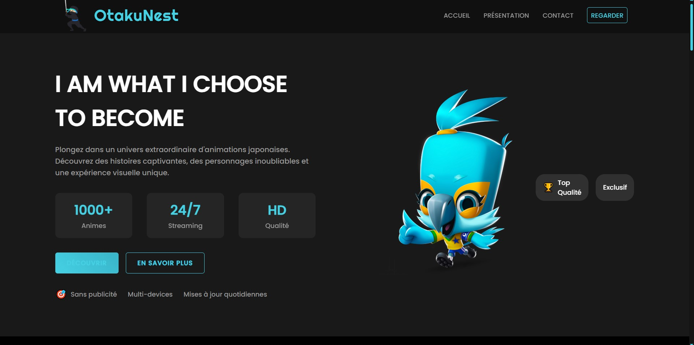

# 🎬 ANIMES SITE

Un site web moderne et interactif dédié aux animes, offrant une expérience utilisateur immersive avec des animations fluides et un design responsive.




### 🎯 Caractéristiques générales
- Menu responsive avec animation hamburger
- Footer avec newsletter
- Navigation fluide entre les pages
- Design adaptatif pour tous les écrans
- Optimisations des performances

## 🛠 Technologies utilisées

- HTML5
- CSS3 (Animations et Flexbox/Grid)
- JavaScript (ES6+)
- GSAP (Animations)
- ScrollTrigger
- Responsive Design

## 💻 Installation

1. Clonez le repository :
```bash
git clone [url-du-repo]
```

2. Accédez au dossier du projet :
```bash
cd anime-site
```

3. Ouvrez le fichier `index.html` dans votre navigateur ou utilisez un serveur local.

## 📁 Structure du projet

```
anime-site/
│
├── index.html
├── presentation.html
├── contact.html
├── README.md
│
├── css/
│   ├── style.css
│   ├── contact.css
│   └── presentation.css
│
├── js/
│   └── main.js
│
└── images/
    ├── img1.png
    ├── img2.png
    ├── img3.png
    ├── demon.png
    ├── juju.png
    ├── one.png
    └── Hero.png
```
## 🤝 Contribution

Les contributions sont les bienvenues ! Pour contribuer :

1. Forkez le projet
2. Créez une branche pour votre fonctionnalité
3. Committez vos changements
4. Poussez vers la branche
5. Ouvrez une Pull Request

## 👩‍💻 Auteur

**Khadija DRIDER**
- Site Web : [animes-site.com](https://animes-site.com)
- GitHub : [@KhadijaDrider](https://github.com/Duja1323)

## 📄 Licence

Ce projet est sous licence MIT. Voir le fichier `LICENSE` pour plus de détails.

---
Créé avec ❤️ pour les fans d'anime 
